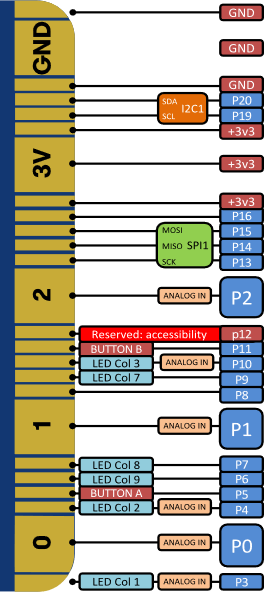
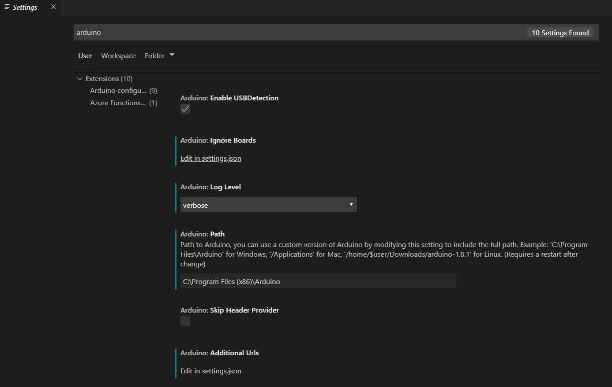
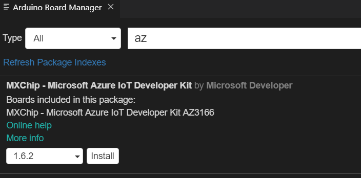
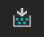

# Lab 1
21 Sept 2019

## Overview
This session we will introduce teh world of IoT through the Arduino, using the MXChip. 
We will cover the basics of interacting with, and programming the hardware and some basics around Azure and IoT Central.

## Information about the MXCHIP
[MXChip in SA](https://za.rs-online.com/web/p/radio-frequency-development-kits/1845096/)
[MXChip Documentation](https://microsoft.github.io/azure-iot-developer-kit/docs/projects/)
[IOT Central Documentation](https://docs.microsoft.com/en-us/azure/iot-central/)

### MXChip Pinouts


[pinout source](https://github.com/peterblazejewicz/az3166-mxchip-iot-devkit-pinout)


## Hands on labs:
- [Setup software](#setup) 
- [Introduction to programming Ardiuno (Blinky)](#hands-on-lab-1) | ([MS docs overview](https://docs.microsoft.com/en-us/azure/iot-hub/iot-hub-arduino-iot-devkit-az3166-get-started) )

## Setup
To install and configure your system you need the following software installed:
[Ardiuno](http://arduino.cc/) and [VSCode](https://code.visualstudio.com/Download)

1. After they have been installed, open up VSCode and install the **Arduino** extension

1. Then install the **Azure IoT Tools**

1. Configure VSCode Settings:
In VSCode, click File > Preferences > Settings and then search for "Arduino"

1.1 For **Arduino.Path** enter the install location of the **Arduino IDE**
1.2 Then select "Edit in settings.json" under the "Additional Paths". This will open up JSON settings. Make sure that the path to the mxchip board definitions are included. It should look something like this:
```
"arduino.path": "C:\\Program Files (x86)\\Arduino",
    "arduino.additionalUrls": [
"https://raw.githubusercontent.com/VSChina/azureiotdevkit_tools/master/package_azureboard_index.json"
    ],
```
1.3 Close and re-open VSCode
1.4 Press "F1" and select "Arduino: Board Manager"

1.5 Search for "az" and then select to install the latest version of **MXChip - Microsoft Azure IoT developer Kit**



## Hands on Lab 1
This HOL you are going to program the MXChip with the IoT equivalent of "hello world".

1. Create a new folder and open it in VSCode
2. Create a new file "Blinky.ino" and open it in VSCode
3. Copy and paste the following code:
```c
//Include required libraries
#include "RGB_LED.h"

//define globals and constants
RGB_LED rgbLed;
uint8_t color[][3] = {
        {255, 0, 0},                // red
        {0, 255, 0},                // green
        {0, 0, 255},                // blue
        {0, 0, 0},
        {255, 255, 0},
        {0, 255, 255},
        {255, 0, 255},
        {255, 255, 255}
};

//Used to configure the environment assign resources 
void setup(){
}

//Programming loop. Executes and performs the actions required
void loop(){
    for(int i = 0; i< 8; ++i)
    {
        Serial.printf("Red: %d, Green: %d, Blue: %d\n", color[i][0], color[i][1], color[i][2]);
        rgbLed.setColor(color[i][0], color[i][1], color[i][2]);
        delay(1000);
    }
    Serial.println("Turn off");
    rgbLed.turnOff();
    delay(1000);
}
```
4. Plug the MXCHip board using the USB cable into a USB port on your PC
5. You should notice a VSCode recognises it and brings up an information / sample page
6. Click the "Compile" button (you will find it on the top left of VSCode, the button with the small check mark on it  )
7. In the output window you will notice a compile has started. It should complete without any issues
8. When it has completed successfully, press the upload button ( ) to deploy the code to the device. You should notice, when the upload has completed the RGB Led starts flashing different colours
