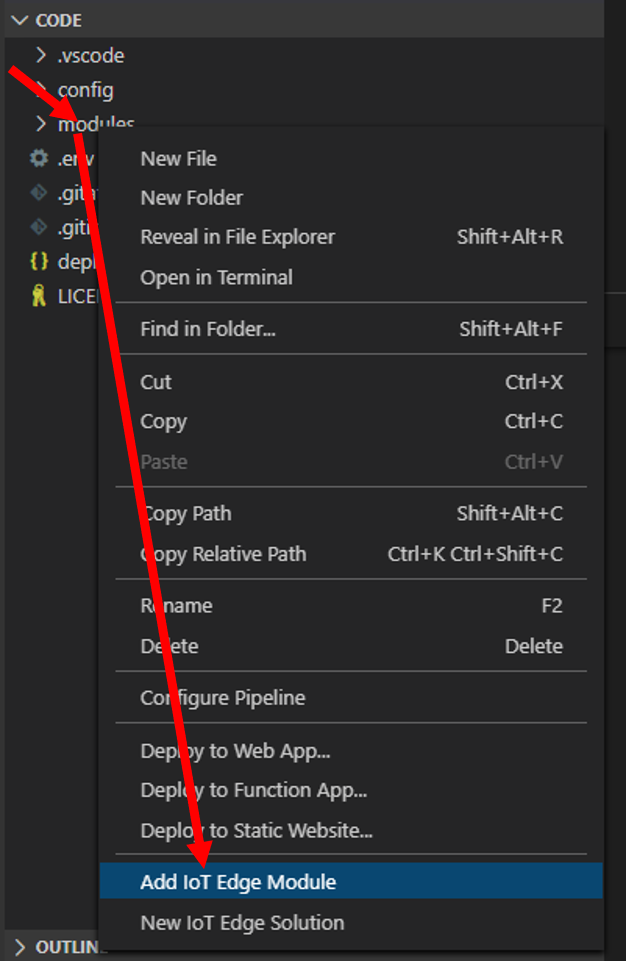

# Lab 3

## Overview
Introduction to developing using an IoT Edge device and interacting with Microsoft's Azure Services. 
This session is to get everyone up to speed with the process of interacting with more complex hardware and some basics around Azure and AI / Cognitive services but extending it to using dotnet core and interacting with the GPIO (General purpose input/output) directly.

### Start
To start off, we will need the to make sure the pre-requisites are in place per the [previous session](../Session2/README.md#requirements).
In addition to the pre-requisites:
  1. Create an instance of [IoT Hub](../Session2/README.md#create-a-iot-hub-instance)
  2. [Connect your bot to IoT Hub](../Session2/README.md#test-iot-runtime-on-raspberry-pi)


### Create a model
1. Log into [Computer Vision](https://www.customvision.ai/) and create a new Object Detection project
2. Create a new project setting the values accordingly

|Property	| Value|
|----|----|
|Name |	Enter a name for your project
|Resource|	Select create new and create a new resource in your Azure account putting it in the same resource group as you IoT hub |
|Project Type	| Object Detection |
|Domain |	General (compact) |
|Export Capability | Basic platforms |

The proctors will help with the images. _Remember you need at least 15 images to train the model_

2. Train and test
3. When you are happy that it will detect the image appropriately, export the model from the "Performance" tab by selecting "Export" and then use the "Dockerfile" format. Select "ARM (Raspberry Pi 3)" and download

### Create a new module
1. Clone the repo from the location provided by the proctors
2. In the root, there is a '.env' file. Open that and update the values with your Azure Container Registry settings
3. Open the zip file and from the `app` folder copy the 'labels.txt' and 'model.pb' to the `ImageRecognition\app` folder
4. Open the root folder in VSCode
5. Right click on the "Modules" folder and select "Add IoT Edge Module"

6. Complete adding the module with the following settings:

|Property | Value |
|---|---|
|Type|C# module|
|Name | controller |
|Docker image repository | $CONTAINER_REGISTRY_ADDRESS/controller |

7. You should now have a new module with a basic dotnet core application
8. In the `deployment.template.json` file, find the node for your controller. It should look like this
```json
"controller": {
  "version": "1.0",
  "type": "docker",
  "status": "running",
  "restartPolicy": "always",
  "settings": {
    "image": "${MODULES.controller}",
    "createOptions": {}
  }
}
```
9. Update the image to point directly to the arm32v7 Docker file : ` "image": "${MODULES.Controller.arm32v7}", `
10. Replace the `"createOptions":{}` node with the following:
```json
"createOptions": {
  "HostConfig": {
    "Privileged": true,
    "Binds": [ "/dev/gpiomem:/dev/gpiomem" ],
    "Devices": [
      {
        "PathOnHost": "/dev/i2c-1",
        "PathInContainer": "/dev/i2c-1",
        "CgroupPermissions": "rwm"
      },
      {
        "PathOnHost": "/dev/gpiomem",
        "PathInContainer": "/dev/gpiomem",
        "CgroupPermissions": "rwm"
      }
    ],
    "Mounts": [
      {
        "Type": "bind",
        "Source": "/lib/modules/",
        "Target": "/lib/modules/"
      }
    ]
  }
} 
```
This will allow the new container to access the GPIO of the Raspberry Pi
11. A bit further down, find the `routes` section and replace the contents with 
```json
"CameraCaptureToController": "FROM /messages/modules/camera-capture/outputs/output1 INTO BrokeredEndpoint(\"/modules/controller/inputs/input1\")"
```
This will direct communication between the camera-capture module and your new controller module

12. Open the controller folder, and then the "Dockerfile.arm32v7" file. Change the base images to "mcr.microsoft.com/dotnet/core/sdk:3.0-buster" for the _build-env_ and "mcr.microsoft.com/dotnet/core/runtime:3.0-buster-slim-arm32v7". Then open the `controller.csproj` file and change the 'TargetFarmework' to 'netcoreapp3.1' 
 
12. Right click on the `deployment.template.json` file and select 'Build and Push to IoT Edge Solution'. _This may take a while, so feel free to help someone around you 🙂_
13. When that has completed, open up the 'config' folder in vscode, there should be a 'deployment.amd64.json' file in it. Right click on the file and select 'Create Deployment for Single Device', then select your Raspberry's device twin in the dropdown
13. Using Putty or another ssh client, connect to your Raspberry Pi
14. Type ` sudo iotedge logs edgeAgent --tail 10` to see if your Pi is updating
15. if you run `docker ps -a` you should see containers that are running as well. Wait for your controller container to show in the list, and then type `sudo iotedge logs controller`. You should see the json predictions on images captured by the camera and then passed to your ImageRecognition object detection model, relayed back to your new dotnet based controller
16. Now you can start coding to have the bot search the image that the model was trained on

### Controlling the bot
1. Drop down to the terminal and navigate to the location that the `controller` dotnet core project is located. Add the GPIO and Devices library by running the following commands:
```cmd
dotnet add package System.Device.Gpio --source https://pkgs.dev.azure.com/dnceng/public/_packaging/dotnet5/nuget/v3/index.json
dotnet add package Iot.Device.Bindings --source https://pkgs.dev.azure.com/dnceng/public/_packaging/dotnet5/nuget/v3/index.json
```
2. Open up the `Program.cs` file and take a look at the code. You will notice that there is a message handler `PipeMessage` that handles the incoming messages. As you would have noticed the incoming message is in json format

3. In the source code that was provided, there are some helpers and pin mappings that will help you to get up and going to move the bot around


> Notes: <br/>
> If you receive and error `Unhandled exception. System.IO.IOException: Error 13 initializing the Gpio driver` from the controller module. Run `sudo chmod 777 /dev/gpiomem` on your Pi


